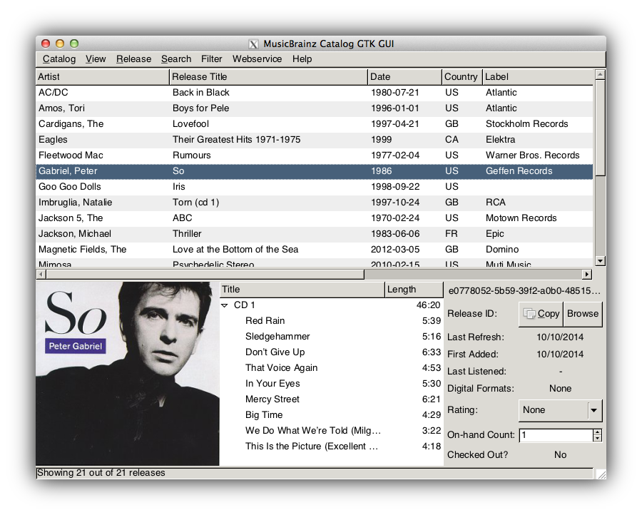

MusicBrainz Catalog
===================

`musicbrainz-catalog` is a Python application for cataloging your music
collection and cross-referencing with the
[MusicBrainz.org](http://musicbrainz.org) online database. Both
[GTK](http://www.gtk.org/) and text-mode interfaces are available. Using
MusicBrainz helps provide the information about the releases you own based on a
[CD TOC](http://musicbrainz.org/doc/Disc%20ID) or a
[barcode](http://en.wikipedia.org/wiki/Universal_Product_Code), for example.
The catch is that if the information about a release in the MusicBrainz.org
online database is missing or incorrect, that you fix it for everyone's benefit.
However, with over 1,293,000 releases (as of 2014-06-12), you should expect to
not have to enter this information about your release most of the time.



This application can help you perform the following tasks:

* Check if you have a particular [release](https://musicbrainz.org/doc/Release)
  or [track](https://musicbrainz.org/doc/Recording) in your collection
* Sort your collection alphabetically, e.g., find where a release should be put
  away
* Create an [HTML](http://en.wikipedia.org/wiki/Html) file representing the
  catalog for archiving, sharing, printing, etc.
* Track which releases you have checked out (e.g., in the car) or lent out
  (e.g., to Sam)
* Search for releases in the MusicBrainz.org online database
    * Using the [CD TOC](http://musicbrainz.org/doc/Disc%20ID) (with
      [python-discid](https://github.com/JonnyJD/python-discid)) (optional)
    * Searching by title, barcode or catalog number
* Synchronize your catalog with a
  [MusicBrainz.org collection](https://musicbrainz.org/doc/Collections)
* Output metatags and a label track to help with converting vinyl to digital
  in [Audacity](http://audacity.sourceforge.net/)
* Track other information like:
    * When, where and the cost when you purchased a release
    * When you listened to a release
    * A personal rating
    * Comments
    * Count (how many you have on-hand)

Installation
============

You'll need the following software to get started:

* [Python](https://www.python.org/),
* [musicbrainzngs](https://github.com/rlhelinski/python-musicbrainzngs),
* [python-discid](https://github.com/JonnyJD/python-discid) (optional; requires
[libdiscid](http://musicbrainz.org/doc/libdiscid)),
* and the `musicbrainz-catalog` source code.

On Ubuntu Linux, get the pre-requisites with the following command:
```bash
sudo apt-get install python python-musicbrainzngs libdiscid0 python-libdiscid
```

Once you have the pre-requisites, we recommend cloning the source code using
Git so that you can stay up to date with development. To copy the source code
with Git so that you can easily upgrade later, use the command:
```bash
git clone https://github.com/rlhelinski/musicbrainz-catalog.git
```
The "master" branch should always be the latest and greatest revision.

To get a ZIP file of the latest version instead of using Git, use the following
link:
https://github.com/rlhelinski/musicbrainz-catalog/archive/master.zip

The 'mbcat-gtk.py' script is the GTK interface to the catalog. Start it with
```bash
python mbcat-gtk.py
```

The 'mbcat-cmd.py' script is the text-mode interface to the catalog. Start it
with
```bash
python mbcat-cmd.py
```

License
=======
This program is free software: you can redistribute it and/or modify it under
the terms of the GNU General Public License as published by the Free Software
Foundation, either version 3 of the License, or (at your option) any later
version.

This program is distributed in the hope that it will be useful, but WITHOUT ANY
WARRANTY; without even the implied warranty of MERCHANTABILITY or FITNESS FOR A
PARTICULAR PURPOSE.  See the GNU General Public License for more details.

You should have received a copy of the GNU General Public License along with
this program.  If not, see <http://www.gnu.org/licenses/>.
